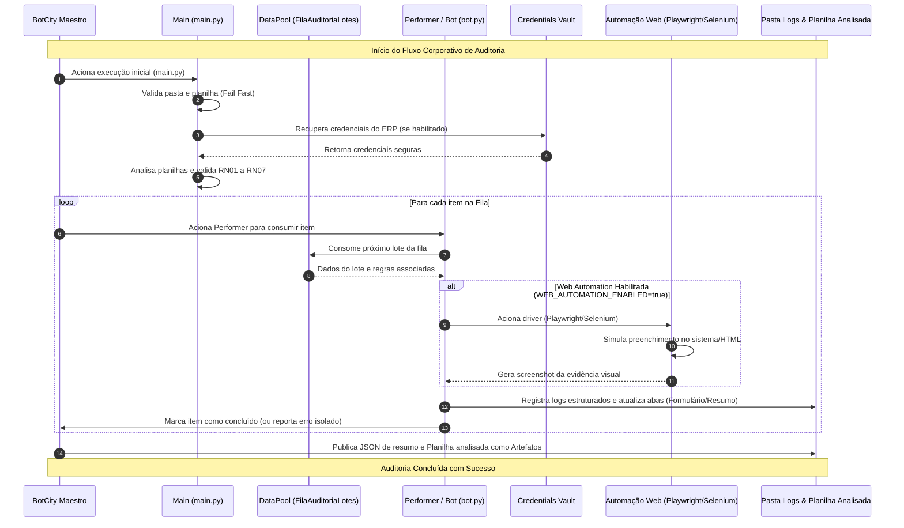

# Auditor de Lotes

Bot corporativo para conferir lotes de qualidade, identificar divergências na planilha de inspeção e preencher automaticamente as abas de evidência da planilha final. O projeto pode ser executado localmente ou pelo BotCity Maestro, com DataPool, Credentials Vault, logs e evidências da execução.

## Autoria

Projeto desenvolvido colaborativamente por:
- **Mariane Oliveira**
- **Teodorio Neto**
- **Victor Breno**

Repositório no GitHub: https://github.com/TeodorioNeto/Bot-Confer-ncia-de-Lotes

## Funcionalidades

- valida a estrutura e os campos obrigatórios da planilha;
- confere os lotes usando a aba `Base_Referencia`;
- valida e normaliza os status de inspeção;
- verifica a observação obrigatória de lotes reprovados;
- preenche a aba `Formulario_Analise` em uma cópia da planilha;
- cria/atualiza a aba `lotes_ambiguos` com os casos RN06;
- cria/atualiza a aba `Resumo_Diario` com indicadores consolidados;
- publica e consome itens pelo DataPool `FilaAuditoriaLotes`;
- recupera a credencial do ERP pelo Credentials Vault;
- registra logs locais com data, hora e severidade;
- gera screenshot por item processado pela automação web;
- replica no simulador web as linhas que feriram regras, como na aba `Formulario_Analise`;
- publica o resumo JSON e a planilha analisada como artefatos no Maestro;
- isola erros por item para que os registros seguintes continuem sendo processados.

## Regras de negócio

| Regra | Validação |
| --- | --- |
| RN01 | A planilha deve ter exatamente as colunas `lote_id`, `produto`, `linha`, `turno`, `status`, `responsavel`, `data` e `observacao` |
| RN02 | `lote_id`, `produto`, `linha`, `turno`, `status`, `responsavel` e `data` não podem estar vazios |
| RN03 | O `lote_id` deve existir na aba `Base_Referencia` |
| RN04 | O status deve ser `APROVADO`, `REPROVADO` ou `PENDENTE` |
| RN05 | `OK` equivale a `APROVADO` e `NOK` equivale a `REPROVADO`; a normalização ocorre antes da validação |
| RN06 | Status não reconhecível nem normalizável é um caso ambíguo encaminhado para revisão humana |
| RN07 | Lote com status `REPROVADO` ou `REPROVADO/OK` deve ter a observação preenchida |

## Estrutura do projeto

```text
.
|-- bot.py                 # regras aplicadas a cada item
|-- config.py              # ambiente, caminhos, DataPool e Vault
|-- main.py                # orquestracao e finalizacao no Maestro
|-- simulador_inspecao_lotes.html # tela web simulada para Playwright/Selenium
|-- testar_local.py        # simulacao local do processamento por item
|-- vault_client.py        # leitura segura da credencial do ERP
|-- src/
|   |-- analise_formulario.py
|   |-- base_referencia.py
|   |-- config.py
|   |-- logger.py
|   |-- relatorio.py
|   |-- validacao.py
|   |-- web_automation.py
|   |-- web_automation_playwright.py
|   `-- web_automation_selenium.py
|-- tests/
|   |-- test_analise_formulario.py
|   `-- test_validacao.py
|-- dados_entrada/         # planilhas de entrada, nao versionadas
`-- logs/                  # logs e artefatos gerados
```

## Requisitos

- Python 3.10 ou superior;
- acesso a uma workspace do BotCity Maestro para a execução corporativa;
- planilha de inspeção no formato esperado pelo projeto.

Instale as dependências:

```powershell
python -m pip install -r requirements.txt
```

Para executar a versão Playwright pela primeira vez, instale também o navegador usado pela biblioteca:

```powershell
python -m playwright install chromium
```

## Configuração local

Crie um arquivo `.env` na raiz do projeto. Esse arquivo é ignorado pelo Git e não deve ser enviado ao repositório.

```
MAESTRO_ENABLED=false
VAULT_ENABLED=false

MAESTRO_SERVER=
MAESTRO_LOGIN=
MAESTRO_KEY=

DATAPOOL_LABEL=FilaAuditoriaLotes
CREDENCIAL_LABEL=credencial_erp
ARQUIVO_INSPECAO=dados_entrada/inspecao_lotes_dia.xlsx

WEB_AUTOMATION_ENABLED=false
WEB_AUTOMATION_DRIVER=playwright
WEB_AUTOMATION_URL=
```

Para usar os serviços do Maestro durante uma execução local, informe as credenciais de acesso e altere `MAESTRO_ENABLED` para `true`. A senha do ERP nunca deve ser colocada no código nem no `.env`.

## Planilha de entrada

Antes de iniciar o bot, crie a pasta `dados_entrada` e coloque nela o arquivo:

```
dados_entrada/inspecao_lotes_dia.xlsx
```

O caminho pode ser alterado pela variável `ARQUIVO_INSPECAO`. A planilha deve possuir, no mínimo, as abas:

- `Inspecao_14_06_2026`, com os registros de inspeção;
- `Base_Referencia`, com os lotes válidos;
- `Formulario_Analise`, onde as divergências serão registradas.

A planilha final gerada também terá:

- `lotes_ambiguos`, com registros de RN06 enviados para revisão humana;
- `Resumo_Diario`, com indicadores de registros, divergências, normalizações e ambiguidades.

O bot aplica validação *fail fast*: se a pasta ou o arquivo de entrada não existir, a execução termina imediatamente. Quando estiver rodando pelo Runner, a falha também é reportada ao Maestro.

## Configuração no BotCity Maestro

### DataPool

Crie um DataPool com o nome:

```
FilaAuditoriaLotes
```

O Dispatcher envia uma linha da planilha por item e inclui o campo `screenshot` para registrar a evidência visual. O Performer marca cada item como concluído ou com erro e continua consumindo a fila mesmo quando um registro apresenta divergência.

### Credentials Vault

Crie uma credencial com o label:

```
credencial_erp
```

A credencial deve conter as chaves:

- `usuario`;
- `senha`.

Somente o usuário pode aparecer nos logs. A senha nunca é registrada.

## Fluxo de execução

```
Planilha -> Dispatcher -> DataPool -> Performer -> Relatorio e evidencias
```

Quando `main.py` esta conectado ao Maestro, ele consome os itens disponiveis no DataPool e consolida as evidencias da execucao. A automacao web atual tambem pode processar a planilha local diretamente pelos drivers Playwright ou Selenium.

## Arquitetura da Automação



## Execução local

Com `MAESTRO_ENABLED=false`, execute:

```powershell
python main.py
```

Nesse modo, o bot analisa diretamente a planilha, preenche o formulário e grava os resultados em `logs/`, sem consumir o DataPool.

Para simular localmente o processamento item a item:

```powershell
python testar_local.py
```

## Automação web de lotes (Implementações Finais)

O projeto mantém duas versões da automação web para registrar lotes e divergências em uma tela web simulada:

- `src/web_automation_playwright.py`, usando Playwright;
- `src/web_automation_selenium.py`, usando Selenium WebDriver.

**Implementações recentes:**

- **Playwright:** blindagem avançada de contexto e gerenciamento de estado para garantir estabilidade absoluta nas navegações em lote sem perda de referência de elementos.
- **Selenium:** ajuste e robustez no método `is_sucesso` para evitar falsos negativos e assegurar a validação correta no fluxo WebDriver.

Os dados preenchidos pela automação web saem da mesma origem usada pelo BotCity: a planilha `dados_entrada/inspecao_lotes_dia.xlsx`. No fluxo corporativo, o Dispatcher lê essa planilha, envia os itens para o DataPool e o Performer aciona a automação web para registrar a evidência do item.

O arquivo `src/web_automation.py` funciona como ponto de entrada comum. Por padrão, ele executa a versão Playwright:

```powershell
python -m src.web_automation
```

Quando executado isoladamente, `python -m src.web_automation` usa o driver configurado em `WEB_AUTOMATION_DRIVER` e dispara o processamento em lote da planilha de entrada pela camada de Page Objects. O fluxo lê os lotes tratados, acessa a tela web local e gera evidências visuais para os registros processados.

A URL da tela é configurada por `WEB_AUTOMATION_URL`. Se essa variável ficar vazia, o projeto usa `doc.html` como tela local simulada. Em homologação, basta apontar para a URL do sistema de inspeção de lotes:

```
WEB_AUTOMATION_URL=https://ambiente-homologacao/sistema-lotes
```

No fluxo com BotCity/DataPool, a automação web só roda quando `WEB_AUTOMATION_ENABLED=true`. Na versão atual, ela é acionada como processamento web consolidado pelo driver escolhido, reaproveitando a planilha de entrada e os Page Objects de login/formulário.

Cada item processado pela automação web gera um screenshot em:

```
logs/screenshots/playwright/
logs/screenshots/selenium/
```

O caminho dos screenshots fica organizado por driver em `logs/screenshots/`. A pasta de screenshots fica fora do Git pelo `.gitignore`.

Para executar a versão Selenium:

```powershell
$env:WEB_AUTOMATION_DRIVER='selenium'
$env:SELENIUM_HEADLESS='true'
python -m src.web_automation
```

Também é possível executar cada versão diretamente:

```powershell
python -m src.web_automation_playwright
python -m src.web_automation_selenium
```

### Comparação métrica (execução local)

| Métrica | Playwright | Selenium |
| --- | --- | --- |
| Status | SUCCESS | SUCCESS |
| Rodadas executadas com sucesso | 3 | 3 |
| Tempo médio | 2.855s | 10.664s |
| Menor tempo | 2.764s | 10.121s |
| Maior tempo | 2.962s | 11.679s |
| Linhas analisadas | 25 | 25 |
| Divergências exibidas no simulador | 11 | 11 |
| Análises registradas por screenshot | 11 | 11 |
| Dimensão do screenshot | 1280x926 | 1280x926 |

Evidências geradas na execução local:

```
logs/comparativo_playwright_selenium.json
logs/comparativo_playwright_selenium.md
logs/screenshots/playwright/20260727_224950_766236_playwright_LG-2026-00103.png
logs/screenshots/selenium/20260727_225015_427236_selenium_LG-2026-00103.png
```

Na medição realizada, ambos os drivers exibiram as mesmas 11 divergências da planilha no simulador. O Playwright foi mais rápido no cenário medido, enquanto o Selenium produziu a mesma evidência visual usando o fluxo WebDriver.

## Execução pelo Runner

Cadastre e publique o pacote do bot no Maestro com `main.py` como ponto de entrada. O Runner fornece os argumentos de autenticação e o identificador da tarefa automaticamente.

Durante a execução, o bot:

- registra o início da auditoria;
- valida a pasta e a planilha de entrada;
- recupera a credencial do Vault, quando habilitado;
- executa o Dispatcher;
- consome os itens do DataPool;
- publica as evidências;
- finaliza a tarefa com sucesso ou falha.

## Execução com Docker

Construa a imagem:

```powershell
docker compose build
```

Execute o bot:

```powershell
docker compose run --rm auditor-lotes
```

- A pasta `dados_entrada/` é montada no container em modo somente leitura.
- Os logs e relatórios gerados em `/app/logs` são persistidos na pasta `logs/` da máquina host.
- As variáveis `EXECUTION_ID` e `BOT_ID` identificam cada execução nos logs estruturados em JSON.

## Saídas e evidências

Os arquivos gerados ficam na pasta `logs/`:

| Arquivo | Conteúdo |
| --- | --- |
| `execucao.log` | Eventos da execução com timestamp e severidade |
| `resumo_execucao.json` | Totais, falhas e divergências encontradas |
| `screenshots/playwright/*.png` | Evidências visuais geradas por item com Playwright |
| `screenshots/selenium/*.png` | Evidências visuais geradas por item com Selenium |
| `inspecao_lotes_dia_analisado.xlsx` | Cópia da planilha com `Formulario_Analise`, `lotes_ambiguos` e `Resumo_Diario` preenchidos |

Quando a execução ocorre pelo Runner, o JSON, a planilha analisada e os screenshots gerados também são publicados como artefatos da tarefa no Maestro.

## Testes

Execute a suite principal:

```powershell
python -m pytest -q
```

Alternativa com o unittest:

```powershell
python -m unittest discover -s tests -p "test*.py"
```

Resultado esperado no estado atual:

```
45 passed
```

## Pacote para BotCity Maestro

O pacote de upload deve seguir o layout abaixo, igual ao zip usado em aula:

```
main.py
bot.py
config.py
vault_client.py
requirements.txt
README.md
simulador_inspecao_lotes.html
src/
dados_entrada/inspecao_lotes_dia.xlsx
```
